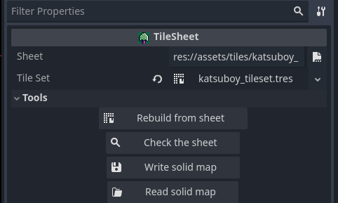
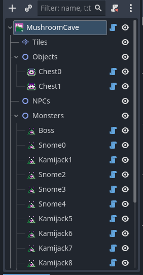
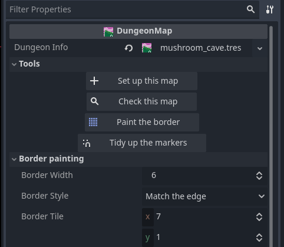
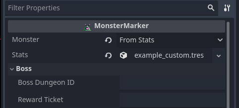
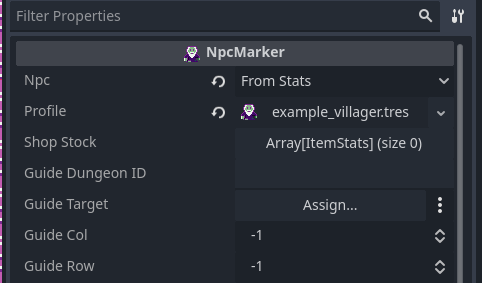
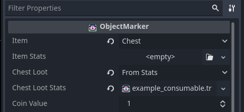
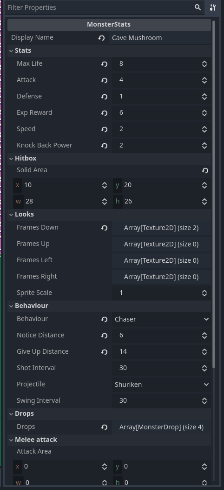
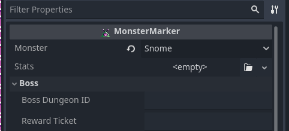
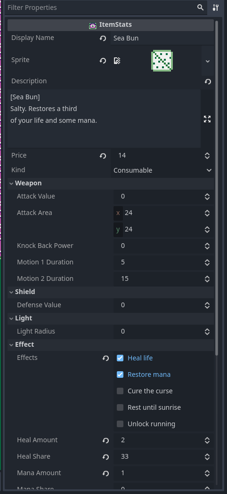
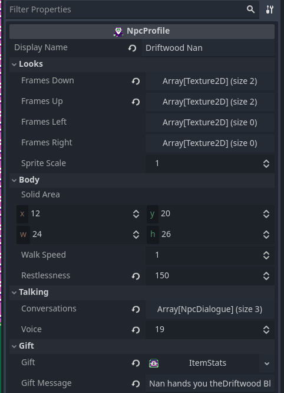

# Working on Katsu Boy

> Looking for *what to build next* rather than how to build it? See
> **[ROADMAP.md](ROADMAP.md)** — what the game loop is missing, the smallest
> shape that makes it a complete game, a build order, and step-by-step recipes
> for adding monsters, bosses, dungeons, items, an objective tracker and an
> ending using the framework described here.


Everything you can change without writing code, and exactly where it lives in
the Godot editor. Godot 4.5.1 — open `KatsuBoyGodot/project.godot`, press **F5**
to play.

- [Where things are](#where-things-are)
- [Finding your way around a map scene](#finding-your-way-around-a-map-scene)
- [Where the tile editor is](#where-the-tile-editor-is)
- [Painting maps](#painting-maps)
- [Placing things on a map](#placing-things-on-a-map)
- [Node reference](#node-reference)
- [Dungeons, tickets and the boat](#dungeons-tickets-and-the-boat)
- [Building a new map or dungeon](#building-a-new-map-or-dungeon)
- [Settings you can tune](#settings-you-can-tune)
- [Controls and rebinding](#controls-and-rebinding)
- [Dev tools](#dev-tools)
- [What still needs code](#what-still-needs-code)
- [Running the tests](#running-the-tests)

---

> **Building a dungeon?** [DUNGEON_CHEATSHEET.md](DUNGEON_CHEATSHEET.md) is the
> one-page version of everything on this page that a level designer needs, with
> nothing about code in it. This file is the full reference.

## Where things are

| I want to change... | Open |
|---|---|
| whether a map is set up right | `scenes/maps/<Map>.tscn` → select the **root** → **Check this map** |
| the terrain of a map | `scenes/maps/<Map>.tscn` → select **Tiles** |
| what's on a map (items, monsters, NPCs, doors) | `scenes/maps/<Map>.tscn` → the group nodes |
| which tiles block movement | `assets/tiles/katsuboy_tileset.tres`, or `assets/tiles/katsuboy_sheet.solid.txt` |
| adding tiles from a sheet you drew | `assets/tiles/katsuboy_sheet.png` (16 px), then `scenes/tools/TileSheet.tscn` → **Rebuild from sheet** |
| monster stats, art, behaviour and drops | `assets/data/monsters/*.tres` |
| adding a whole new monster | copy `assets/data/monsters/example_custom.tres` |
| adding a whole new item | copy `assets/data/items/example_weapon.tres` |
| adding a whole new character | copy `assets/data/npcs/example_villager.tres` |
| what a character says | their `NpcDialogue` conversations, or `scripts/entity/NPC_*.gd` for the four with scripts |
| the player's starting stats and speeds | `assets/data/player.tres` |
| the exp curve and what a level gives you | `assets/data/player.tres` → Levelling |
| what the three classes are good at | `assets/data/classes/*.tres` |
| sounds and music | `assets/data/sound_bank.tres` |
| the list of maps, colours, day/night length | `main.tscn` → select **GamePanel** |
| key bindings | Project Settings → Input Map |
| where the boat goes, and when | `assets/data/dungeons/*.tres` |
| how much money things are worth | `Drops` in `assets/data/monsters/*.tres`, the tables in `scripts/monster/MON_*.gd`, `Coin Value` on markers |

---

## Finding your way around a map scene

A map is 100 x 100 tiles — 4800 x 4800 pixels — and the editor opens at the
top-left corner, so the thing you want is usually off screen. Three ways to get
to it:

**Frame a node.** Click it in the **Scene** dock and press **F**. The 2D view
jumps to it and zooms in. This is the fastest way to find the merchant, a
doorway, or the player start — click it in the tree, press F, and you're there.

**Get around by hand.** Middle-mouse drag (or space + drag) pans. Scroll wheel
zooms. **Shift+F** toggles freelook-style panning with the arrow keys.

**See the whole map.** Select the **Tiles** node and press **F** to frame the
entire painted area at once, then zoom in where you want to work.

### Playing a single map

Walking from the start to a dungeon every time you want to test it gets old.
Open `main.tscn`, select **GamePanel**, and set **Debug Start Map** to that
map's number — the game boots straight into it, on that map's PlayerStart (or
somewhere sensible if it hasn't got one). Set it back to `-1` when you're done.

In game, **F9** jumps to the next map, which is quicker for a look around.

> Map numbers are positions in GamePanel's **Map Scenes** list: `WorldMap` is 0,
> `MushroomHut` is 1, `TestMap` is 2.

---

## Where the tile editor is

This trips everyone up once.

**The TileMap editor only appears when you select a TileMapLayer node.** And you
have to open the map's own scene to do that — in `main.tscn` the maps are
*instances*, and Godot won't let you edit an instance in place.

1. **FileSystem** dock (bottom left) → `scenes/maps/` → double-click
   **`WorldMap.tscn`**.
2. In the **Scene** dock (top left), click the **`Tiles`** node.
3. A **TileMap** panel appears along the bottom of the window, with the tile
   palette in it. If you don't see it, drag the bottom panel upwards — it can
   be collapsed to nothing.
4. Pick a tile from the palette and paint on the canvas. **Ctrl+S** to save.

To edit the TileSet itself (which tiles block movement, adding tiles), click
the **Tile Set** property in the Inspector while `Tiles` is selected — the
bottom panel switches to a **TileSet** tab.

---

## Painting maps

With `Tiles` selected, the bottom panel gives you the usual tools: pencil,
line, rectangle, bucket fill, and an eraser (hold right mouse button). Rectangle
select and copy/paste work for moving chunks of a map around.

The maps are 100×100 tiles. The player sees about 20×12 at a time.

> **Paint every cell.** An unpainted cell counts as tile 0 (grass) and is
> walkable. For a dungeon, fill the whole rectangle with wall first, then carve
> the rooms out of it.

### Which tiles block movement

Collision belongs to the *tile*, not the map, so a tree blocks everywhere at
once.

1. Select **Tiles** → in the Inspector click the **Tile Set** resource.
2. Bottom panel → **TileSet** tab → **Select** mode → click a tile.
3. In the Inspector, **Custom Data → collision**, tick or untick.

That one flag is read by both the collision checker and the pathfinder, so
monsters immediately stop trying to walk through anything you mark solid.

### Sixteen in, forty-eight out

**Everything in this game is drawn at 16 × 16.** The game runs at three times
that — `GamePanel` has `ORIGINAL_TILE_SIZE = 16` and `SCALE = 3`, so a tile is
**48 × 48 on screen** and the whole world grid is measured in 48s. Sprites are
upscaled the same way when they load.

So when a document says a tile is 48, it means on screen. You draw 16.

That is why there are two pictures in `assets/tiles/`:

| | |
|---|---|
| `katsuboy_sheet.png` | **the one you draw.** 16 × 16 cells. |
| `katsuboy_atlas.png` | **generated.** Every cell blown up ×3 with nearest-neighbour. The tile set points at this. Don't edit it. |

### Adding tiles from a sheet

Draw a sheet in Aseprite, drop it in, press a button. No code, no list of file
names, no upscaling by hand.



1. **In Aseprite**, lay the tiles out in a grid at **16 × 16**, with **no
   padding and no gaps**. Leave a cell completely empty to skip it. Export as
   PNG at **1× — do not upscale**; the tool does that.
2. Save it into `assets/tiles/` and let Godot import it. The project's texture
   filter is already **Nearest**, so pixel art stays sharp; you do not have to
   change any import setting.
3. Open **`scenes/tools/TileSheet.tscn`**, point **Sheet** at your PNG, and
   press **Rebuild from sheet**. It writes the upscaled `katsuboy_atlas.png`
   and rebuilds the tile set from it.
4. Tick **collision** on the tiles that should be walls — select the tile in the
   TileSet editor and tick it there, or see the solid map below.

| Button | Does |
|---|---|
| **Rebuild from sheet** | upscales the sheet ×3 into the atlas; a tile for every drawn cell; drops tiles whose cell went empty; **keeps the collision you already ticked**, matched up by position |
| **Check the sheet** | reports what the sheet and the tile set disagree about, in the **Output** panel and as a warning triangle |
| **Write solid map** | writes which tiles are walls to a text file beside the sheet |
| **Read solid map** | applies edits to that file back onto the tile set |

Godot has its own *Create tiles in non-transparent texture regions* button, and
it works. The reason to use this one instead is the third column of that table:
Godot's button rebuilds the tiles and you tick all the collision again.

> **Which tiles does a dungeon need?** `DUNGEON_CHEATSHEET.md → Tiles a dungeon
> needs` is the shopping list, and why a wall is nine tiles rather than one.

### Which tiles are walls, as text

`assets/tiles/katsuboy_sheet.solid.txt` is a picture of the sheet in three
characters — `#` solid, `.` walkable, a space where there is no tile:

```
...........
.....######
#########.#
##.########
```

It is written by **Write solid map** and applied by **Read solid map**, so
collision is something you can read in a diff and edit in any text editor
rather than only by clicking. A test checks that the file and the tile set still
agree, so neither can drift without something failing.

Lines that are anything other than those three characters are notes. A row whose
left-hand tile is solid starts with a `#`, which is why rows are recognised by
what they contain rather than by their first character.

### Tile numbers

A tile's id is its position in the sheet: `id = row × columns + column`. Grass is
0, the tree 16, the wall 17, water 18–30. (Tile *16* and the *16 px* art size are
an unhappy coincidence — they are unrelated.)

**The number of columns is read off the sheet**, not written down anywhere. That
matters: maps store atlas *coordinates*, so a wider sheet would renumber every
tile at run time while the painted maps stayed put — the game would load, and
the grass would be water.

For the same reason, nothing in the authoring tools names a tile by number any
more. `DungeonMap`'s **Paint the border** repeats whatever is already at the
nearest edge, so water runs out to sea and forest stays forest, with no list of
which numbers count as water.

---

## Placing things on a map

Each map scene has group nodes to put markers under:

```
WorldMap                 ← DungeonMap script on the root
├── Tiles                (TileMapLayer — the terrain)
├── Objects              items, chests, doors
├── NPCs
├── Monsters
├── InteractiveTiles     the dry tree you chop
├── Events               pits, save points, doorways between maps
└── PlayerStart          where a new game begins
```



**You don't have to build that by hand.** The root of every map scene carries
the `DungeonMap` script, which puts four buttons at the top of the Inspector:

| Button | Does |
|---|---|
| **Set up this map** | creates the `Tiles` layer with the tile set already in it, plus any of the five group nodes that are missing. Safe to press twice. |
| **Check this map** | walks the whole map and lists what's wrong in the **Output** panel. |
| **Paint the border** | fills the edges outside the painted area so the camera never shows the void. Repeats whatever is already at the nearest edge, so water runs out to sea and forest stays forest. |
| **Tidy up the markers** | snaps every marker to the nearest tile. |



It also shows a **yellow warning triangle** on the root node listing every
problem it can see — a marker in a wall, two things on one tile where one is
solid, a locked door with no key on the map, a dungeon with no boss, more
markers than there are slots. Each individual marker carries its own triangle
too, so you can click straight to the offender.

Nothing on the root runs in the game. It is editor furniture, like the markers.

You can sort markers into sub-folders — `Monsters/Upper Floor`,
`Objects/Room 3` — and they are still found. Tree order is preserved, which
matters for Events: the first one the player is touching wins.

**The markers are real node types.** You don't attach scripts by hand:

1. Select the group (say **Monsters**).
2. **Add Child Node** (the **+** button, or **Ctrl+A**).
3. Type the node's name in the search box — `MonsterMarker`, `ObjectMarker`,
   `NpcMarker`, `InteractiveTileMarker`, `EventMarker`, `PlayerStartMarker`.
   They have their own icons in the list.
4. Pick what it is from the dropdown in the Inspector.
5. Drag it onto a tile.

**Turn on grid snapping** so things land on tiles: the magnet icon in the
toolbar, then **Configure Snap → Grid Step 48 × 48**, and enable **Use Grid
Snap**. (48 because the world grid is in screen pixels — the art itself is 16;
see *Sixteen in, forty-eight out* above.) A marker that's off-grid still rounds to the nearest tile at run time,
but then what you see is not quite what the game builds, and two markers that
look like neighbours can turn out to share a tile — so an off-grid marker
raises a warning, and **Tidy up the markers** fixes them all at once.

Each marker draws its real sprite in the editor, so you can see what you placed.
Markers never draw in game — at startup `AssetSetter` reads them and builds the
actual entities.

> **Watch out for markers on the same tile.** A Slime spawns on tile 8,46 in
> `WorldMap` — the same tile as the doorway to the hut — so it can physically
> stand in the door and block it. That came straight from the Java version.
> Now that both are nodes you can just drag one of them off the other.

**Per-map limits:** 40 objects, 10 NPCs, 80 monsters, 50 interactive tiles.
Going over is ignored — **Check this map** says so, and so does the root's
warning triangle. To raise one, change the matching number in
`GamePanel._ready()` (`_new_entity_array(40)`).

**Monsters respawn** from their markers whenever the map resets — on death, on
restart, and when the player rests at a healing pool. Objects the player picked
up come back on a full restart.

---

## Node reference

### `MonsterMarker`
Under **Monsters**. Spawns one monster.

| Property | What it does |
|---|---|
| **Monster** | Slime / Snome / Kamijack / Shadow / Boss / **From Stats** |
| **Stats** | a `MonsterStats` from `assets/data/monsters/`. For a named monster this is an *override* — same script, same art, different numbers, so you can put one tougher Slime at the back of a dungeon without writing a second Slime. For **From Stats** it is the whole monster. For a `Boss` it is close to required: without one the boss is a Kamijack with six times the health, which is a placeholder, not a fight. |
| **Boss Dungeon Id** | `Boss` only — the `DungeonInfo` id this boss guards. Killing it clears that dungeon. |
| **Reward Ticket** | `Boss` only — the `ticket_id` of the route its death opens. Leave empty if it opens nothing. |

A named monster's numbers come from `assets/data/monsters/<name>.tres`, and its
art and behaviour from `scripts/monster/MON_<Name>.gd`. A `Boss` is built from
those numbers and then multiplied up — six times the health, double the attack —
in `scripts/monster/MON_Boss.gd`.



**A new monster does not need a script.** Set Monster to `From Stats` and drag
in a `MonsterStats` resource that carries its art, its behaviour and its drop
table. `assets/data/monsters/example_custom.tres` — the Cave Mushroom in the
mushroom cave — is one; copy it and change the numbers. See
[`assets/data/monsters/*.tres`](#assetsdatamonsterstres) below for every field.

### `NpcMarker`
Under **NPCs**. Spawns a character you can talk to.

| Property | What it does |
|---|---|
| **Npc** | OldMan / NanaMan / Merchant / TicketMan / **From Stats** |
| **Profile** | the character itself, when Npc is `From Stats`. Drag one in from `assets/data/npcs/`. |
| **Shop Stock** | `Merchant` only — a list of `ItemStats` to put on the shelf. Empty keeps the built-in stock. Boat tickets are added on top either way. |
| **Guide Dungeon Id** | `OldMan` only. Fill this in and he becomes a signpost: he tells you about that dungeon, makes it your objective, then walks off towards the dock. Empty = ordinary small talk. |
| **Guide Target** | drag the marker he walks to — the Boat dock's `EventMarker`, usually. Move the dock and he follows it. |
| **Guide Col / Row** | the same thing typed out by hand, for a destination with no marker of its own. Ignored when Guide Target is set. `-1` means he stays put and wanders. |



**A new character does not need a script.** Set Npc to `From Stats` and drag in
an `NpcProfile`: their art, how restless they are, and their conversations as a
list. Talking moves forward one conversation each time and then stays on the
last, which is what makes a villager read as written rather than recorded. A
profile can also carry a **gift** — an item handed over the first time you talk
to them, once per run. `assets/data/npcs/example_villager.tres` — Driftwood Nan,
west of the port — is a worked example.

The four named characters have scripts because each of them *does* something:
the Merchant opens the shop, the collector takes tickets, the old man walks you
to the boat. Those are rules, not lines. Their dialogue is in their scripts —
except a guide's, which is written from the dungeon's `hint`, price and
timetable so it can never contradict the boat.

**TicketMan** is the ticket collector. Stand him at a boat dock: he takes a
paper ticket out of the player's bag and stamps one trip on the boat. Tickets do
nothing when used from the inventory, so he is the only way to board, and he
needs no properties — he takes whatever route the player is carrying.

The Merchant's stock is partly generated too: a dungeon whose `ticket_price` is
above zero goes on the shelf, either from the start (`sold_from_start`) or once
the player has held one of its tickets. Tickets are used up, so the shop keeps
selling them.

### `ObjectMarker`
Under **Objects**. An item, chest or door.

| Property | What it does |
|---|---|
| **Item** | which item — coins, keys, weapons, Boots, Chest, Door… or **From Stats** |
| **Item Stats** | the item itself, when Item is `From Stats`. Drag one in from `assets/data/items/`. |
| **Chest Loot** | only used when Item is `Chest`: what's inside. `From Stats` here too. |
| **Chest Loot Stats** | what's in the chest, when Chest Loot is `From Stats` |
| **Coin Value** | only used when the item (or the chest's loot) is a Kami Coin: how much it is worth. 1 is loose change, 5 a purse, 20 a real find. Bigger coins are drawn bigger. |

Pickup-only items (coins, hearts, mana, Boots) are used the moment you walk over
them. Weapons, shields, keys and potions go into the inventory. `Door` and
`Chest` are obstacles you interact with using the Confirm key.



**A new item does not need a script.** Set Item to `From Stats` and drag in an
`ItemStats` resource that carries its sprite, its price, its numbers and what
using it does. `assets/data/items/example_weapon.tres` and
`example_consumable.tres` are worked examples — copy one. See
[`assets/data/items/*.tres`](#assetsdataitemstres) below for every field.

### `InteractiveTileMarker`
Under **InteractiveTiles**. Scenery you can destroy.

| Property | What it does |
|---|---|
| **Kind** | DryTree — chop it with the Kami Axe, it becomes a stump |

The pathfinder treats these as solid until they're destroyed. A felled dry tree
drops a coin 40% of the time, so scattering a few is a small, one-time reason to
carry the axe.

### `EventMarker`
Under **Events**. Fires when the player steps on its tile.

| Property | What it does |
|---|---|
| **Kind** | see the table below |
| **Required Direction** | `any`, or the way the player must be walking for it to fire |
| **Target Scene** | `ChangeMap` only — drag the destination's `.tscn` straight in from `scenes/maps/`. The map number is worked out at load time. |
| **Target Map** | the map number typed out by hand. Filled in from Target Scene when one is set, so leave it alone. |
| **Target Col / Row** | the tile the player arrives on (`Teleport` and `ChangeMap`) |
| **Speak Npc** | `Speak` only — drag the NpcMarker to talk to |
| **Dock Of** | `Boat` only — the id of the dungeon this dock is in. The boat never offers to sail you where you already are. Leave empty for the home port. |

| Kind | Does |
|---|---|
| `ChangeMap` | moves the player to another map |
| `Teleport` | moves the player elsewhere on the same map |
| `DamagePit` | costs 1 life |
| `HealingPool` | full heal, respawns monsters, **saves the game** |
| `Speak` | starts a conversation |
| `Boat` | opens the Wunderboat's timetable — press Confirm while standing on it |

Markers are checked top to bottom in the scene tree and the **first match
wins**, so if two overlap, move the one you want higher up.

**Linking two maps** needs a marker on *both* sides, or the player walks through
and is immediately sent back:

- In `WorldMap`, at the door tile: `ChangeMap`, **Target Scene** =
  `MushroomHut.tscn`, Target Col/Row = where they arrive inside.
- In `MushroomHut`, at *that arrival tile*: `ChangeMap`, **Target Scene** =
  `WorldMap.tscn`, Target Col/Row = the tile just outside the door.

The existing hut door is set up exactly like this — copy it as a template. A
`ChangeMap` with no Target Scene raises a warning, because a hand-typed map
number points somewhere else the moment anybody reorders the map list.

### `PlayerStartMarker`
Anywhere in any map scene. Where a new game begins and where the player
respawns. Put exactly one in the whole project. No properties — just its
position. Without one, the game falls back to tile 94,94 on map 0.

### Dungeons, tickets and the boat

A destination is a `.tres` file, not code. `assets/data/dungeons/*.tres` each
describe one place the boat goes — which map, which tile you land on, which days
it sails, what the ticket costs and whether it is sold from the start, what must
be cleared first, and the hint the guide gives. Drop them into
**GamePanel → Dungeons** in `main.tscn`.

A ticket is good for **one trip**, and only the collector at the dock can turn
it into passage. Sailing home is always free.

`ROADMAP.md → The boat, the tickets and the quest log` has the full picture and
a step-by-step for adding one, including the generator that builds a dungeon map
skeleton for you.

---

## Building a new map or dungeon

1. **Scene → New Scene → 2D Scene**. Rename the root, e.g. `CryptLevel1`.
2. With the root selected, attach **`scripts/authoring/DungeonMap.gd`** to it
   (the script icon above the Inspector, then **Load**).
3. Press **Set up this map**. That makes the `Tiles` layer with the tile set
   already in it and all five group nodes, named correctly.
4. Paint the level (bucket-fill wall first, then carve), then press
   **Paint the border** so the camera never shows the void past the edge.
5. Drop markers under the groups. Press **Check this map** whenever you want to
   know what is still wrong.
6. Save into `scenes/maps/`.
7. Open `main.tscn`, select **GamePanel**, find **Map Scenes** in the Inspector,
   press **+**, and drop your scene in.
8. Add `ChangeMap` events on both sides to connect it to an existing map,
   dragging each destination's `.tscn` into **Target Scene**.

> The names `Tiles`, `Objects`, `NPCs`, `Monsters`, `InteractiveTiles` and
> `Events` are how the game finds things. They must match exactly — which is
> the reason **Set up this map** exists rather than a list of names to type.

**To make it a boat destination** as well, make a `DungeonInfo` `.tres` in
`assets/data/dungeons/`, drag it into the root's **Dungeon Info** slot, drop an
`EventMarker` with Kind `Boat` and Dock Of = the dungeon's id on the pier tile,
and add the resource to **GamePanel → Dungeons**. The map number and the
arrival tile fill themselves in from the scene — you never type either.

Also add the new scene to **`tests/SmokeTest.tscn`**'s Map Scenes, so the tests
cover it.

---

## Settings you can tune

### `main.tscn` → GamePanel (Inspector)

| Group | Property | What it does |
|---|---|---|
| | **Map Scenes** | the maps, in order. Index = map number |
| | **Dungeons** | every place the boat sails to, as `DungeonInfo` resources |
| | **Player Classes** | the classes on the title screen, as `PlayerClass` resources |
| | **Items** | every item that is a resource rather than a script. A saved bag holds names, and this is where they are looked up. |
| | **Sound Bank** | which audio set to use |
| | **Debug Start Map** | boot straight into this map. -1 = off |
| Time of day | **Frames Per Time Step** | game frames between clock ticks. 60 = one tick a second |
| Time of day | **Minutes Per Time Step** | in-game minutes each tick adds |
| Time of day | **Start Day / Hour / Minute** | when a new game begins. Day 0 = Sunday |
| Time of day | **Day Rollover Hour** | when the calendar flips over. 0 = midnight |
| Time of day | **Show Clock** | the clock window on the HUD |
| Day / night | **Sunrise Start / End Hour** | dark before, light after |
| Day / night | **Sunset Start / End Hour** | light before, dark after |
| Day / night | **Midday Hour** | when "Morning" becomes "Afternoon" |
| Day / night | **Evening Hour** | when "Afternoon" becomes "Evening" |
| Day / night | **Night Darkness** | 0 = no night, 255 = pitch black |
| Palette | **Color Green / Black / Pink / White** | the four colours the whole UI is drawn from |

### The clock

Time moves in steps, Harvest Moon style: every second of real time the clock
jumps forward five in-game minutes, so a full 24 hours takes about five real
minutes. The HUD shows the day, the time, and which part of the day it is.

At the defaults:

| Hours | Shows as | Light |
|---|---|---|
| 5:00 – 6:00 | Sunrise | fading up |
| 6:00 – 12:00 | Morning | full daylight |
| 12:00 – 17:00 | Afternoon | full daylight |
| 17:00 – 20:00 | Evening | full daylight |
| 20:00 – 21:00 | Sunset | fading down |
| 21:00 – 5:00 | Night | full dark |

**The clock is the single source of truth.** The darkness shader, the merchant's
night prices, the night curse and the HUD all read the same hour, so moving
`Sunset Start Hour` moves all of them together. There is no separate lighting
timer any more.

Sleeping in a tent wakes you at **Sunrise End Hour** on the next day.

In game, **F3** pushes the clock forward three hours, which is the quickest way
to see a night behaviour.

### Days of the week

Each day does something slightly different. The resources are in
`assets/data/days/` — one per day — and GamePanel's **Days of the week → Day
Effects** list holds them in Sunday-to-Saturday order.

| Day | What it does |
|---|---|
| **Sunday** | Kami Mart is shut. Hearts and mana crystals restore 1.5x |
| **Monday** | The player takes 1.3x damage |
| **Tuesday – Thursday** | Ordinary |
| **Friday** | Shop prices are 0.75x |
| **Saturday** | The player deals 1.3x damage |

Every field is a multiplier on a number the game already had, so a day with all
the defaults is just an ordinary day:

| Property | Affects |
|---|---|
| **Damage Dealt Multiplier** | how hard the player hits |
| **Damage Taken Multiplier** | how hard the player is hit |
| **Shop Open** | off = the merchant turns you away |
| **Shop Price Multiplier** | what the merchant charges. Below 1.0 is a sale |
| **Healing Multiplier** | health and mana from pickups |
| **Note** | one line shown when the day starts. Leave blank to stay quiet |

Multipliers are applied with rounding, so they do very little while your numbers
are tiny — 1 damage stays 1 damage — and matter more as you level up and find
better gear. That is on purpose: a brand new character should not be a third
more fragile just because it is Monday. If you want a day to bite from the very
start, give it a bigger multiplier.

To add an effect to an ordinary day, open `assets/data/days/tuesday.tres` and
change a number. To change what a day is *called*, that is `DAY_NAMES` in
`scripts/environment/GameClock.gd`.

### `assets/data/player.tres`

Starting level, life, mana, ammo, strength, dexterity, coins and exp curve;
starting weapon, shield and projectile; and movement:

| Property | What it does |
|---|---|
| **Walk Speed** | pixels per frame normally |
| **Boots Walk Speed** | pixels per frame once you have the Boots |
| **Run Speed** | while holding the Run key |
| **Requires Boots To Run** | off = the player can sprint from the start |

> Running used to be unreachable: the Boots item existed but did nothing, so the
> Run key only worked if you picked the Ninja or Zilla class. Picking up the
> Boots now unlocks it, and there's a pair on the grass near the start. Untick
> **Requires Boots To Run** if you'd rather sprint from the beginning.

### `assets/data/classes/*.tres`

One file per playable class, listed in **GamePanel → Player Classes**. The title
screen builds its menu from that list and writes the one-line summary under each
name from these numbers, so a class can never advertise something it does not do.

The fields are grouped: starting gear, melee (multiplier, swing speed, favoured
weapon, armour it ignores, a night bonus), ranged, body (knock-back both ways,
flat defence, walk speed) and levelling (life, strength, dexterity and mana
gains). `id` is written into save files — never rename one that exists.

Rule of thumb when tuning: a class may be about 30% better at something as long
as it is worse at something else, and none of them may be locked out of any
fight. The test suite checks that no class kills more than twice as fast as
another, that each is the best at something, and that the tanky one really is
tankier.

### `assets/data/monsters/*.tres`



A `MonsterStats` resource. For one of the five named monsters it is just the
numbers, applied to every monster of that type everywhere. For a marker set to
**From Stats** it is the entire monster: art, behaviour and loot as well.

| Group | Fields |
|---|---|
| (top) | **Display Name** — what the damage numbers and the boss bar call it |
| **Stats** | Max Life, Attack, Defense, Exp Reward, Speed, Knock Back Power |
| **Hitbox** | **Solid Area** — the collision box inside the 48×48 tile, as `Rect2i(x, y, w, h)`. Smaller than the sprite is usually right; the player's is 24×24. |
| **Looks** | **Frames Down / Up / Left / Right** — two PNGs each, the walk cycle. Leave Up, Left and Right empty and it faces every way with its Down pair, which is what the Slime does. **Sprite Scale** is how many tiles across and down it is — see *Monsters bigger than one tile* below. |
| **Behaviour** | **Behaviour**: `Wander` drifts and hurts on contact; `Chaser` takes the shortest path to you once you are close; `Fighter` chases and swings; `Shooter` chases, swings and throws. Plus **Notice Distance** and **Give Up Distance** in tiles, **Shot Interval** and **Projectile** for a Shooter, **Swing Interval** for a Fighter. |
| **Drops** | a list of `MonsterDrop` rows — see below |
| **Melee attack** | **Attack Area** (reach of a swing; leave at zero for something that only touches or shoots) and **Motion 1 / 2 Duration** (frames of wind-up, then frames until the swing ends) |

Only the Looks and Behaviour groups are ignored by a named monster — those
already live in `scripts/monster/MON_*.gd`. Everything else applies to both.

**Drop rows** (`MonsterDrop`): each has an **Item** — Coin, Heart, Green Potion,
Mana Crystal or **Nothing** — and a **Weight**. Weights are relative, not
percentages, so `55 / 20 / 25` and `11 / 4 / 5` give the same odds and you can
add a row without redoing the arithmetic on the others. A Coin row also takes
**Coin Min / Max**; it rolls somewhere in that range. `Nothing` is a real row —
use it for the share of kills that pay out nothing, rather than leaving the
weights short.

`example_custom.tres` is a worked example: a Chaser with one pair of frames, a
55/15/15/15 drop table, and no script anywhere.

### Monsters bigger than one tile



**Sprite Scale** on a `MonsterStats` is not just how big it looks. It is:

- how far off-screen it can get before the game stops drawing it — too small and
  a big monster blinks out while half of it is still visible;
- how wide its health bar is;
- **where it sorts in the draw order.** A tall monster's feet are a tile below
  its origin, so it is sorted by its feet. Sorting on the top edge drew it
  *behind* whatever it was standing in front of;
- how much floor the editor insists it has under it.

The tile you place it on is its **top-left**: a 2 covers that tile and the one
below-right. Its **Solid Area** is measured inside the whole sprite, not inside
one tile, so a 2's hitbox can be anywhere in that 96 × 96 square — the Kamijack's
is `(20, 34, 56, 52)`.

In the editor the marker outlines its whole footprint with the tile it actually
sits on picked out, and the warnings walk every tile under it. A two-tile monster
with its head in open floor and its body in a wall looks fine and cannot move.

The same field exists on an `NpcProfile`, and means the same thing.

### `assets/data/items/*.tres`



An `ItemStats` resource. Everything a hand-written item in `scripts/object/`
does, minus the code.

| Group | Fields |
|---|---|
| (top) | **Display Name** — also what it is called on screen, and **the stable key**: saved bags hold names, so never rename one that exists. **Sprite** — one 48×48 PNG. **Description** — shown in the inventory; the box is about 30 characters wide and `\n` breaks a line. **Price** — what Kami Mart charges; the shop buys back at half. |
| **Kind** | `Sword` / `Axe` (a weapon; an Axe also fells dry trees, which is the only difference) · `Shield` · `Light` · `Consumable` (used from the bag) · `Pickup` (used the instant you walk over it, never carried) |
| **Weapon** | **Attack Value** added to your strength, **Attack Area** the reach in pixels, **Knock Back Power**, and **Motion 1 / 2 Duration** — the wind-up and the swing. Those last two are the biggest lever on a weapon: the axe hits twice as hard as the bokken and still loses on damage per second. |
| **Shield** | **Defense Value**, subtracted from incoming damage |
| **Light** | **Light Radius** in pixels. The candle is 250. |
| **Effect** | **Effects** — tick any of *heal life*, *restore mana*, *cure the curse*, *rest until sunrise*, *unlock running*; a tent is four of them at once. Then **Heal Amount** (flat) and **Heal Share** (a percentage of your maximum, so a potion is still worth buying at level 15), the same pair for mana, and a **Use Message**. |
| **Inventory** | **Stackable** (several share one slot, like potions) and **Use Sound** |

**Register it** in `main.tscn → GamePanel → Items`, and in `tests/SmokeTest.tscn`.
Anything in `assets/data/items/` is found by name even if you forget, but the
list is the documented place and the one the tests read.

### `assets/data/npcs/*.tres`



An `NpcProfile` resource: a character with no script.

| Group | Fields |
|---|---|
| (top) | **Display Name** — what the dialogue box calls them |
| **Looks** | **Frames Down / Up / Left / Right** (two PNGs each; Up, Left and Right fall back to Down) and **Sprite Scale** |
| **Body** | **Solid Area** — `(12, 20, 24, 26)` is what the stock NPCs use, small enough for the player to squeeze past in a doorway. **Walk Speed** — 0 for someone who has stood in one spot for thirty years, 2 for a slow amble; the player walks at 4. **Restlessness** — frames between changes of direction. |
| **Talking** | **Conversations** — a list of `NpcDialogue` resources, each one exchange. Talking again moves to the next and the last repeats forever. **Voice** — a sound bank number. |
| **Gift** | an `ItemStats` handed over the first time you talk to them, once per run, and the **Gift Message** that goes with it |

An `NpcDialogue` is a **Label** (a note to yourself, never shown) and **Lines**,
in order. One press of Confirm moves to the next. Lines are wrapped for you, so
you do not have to count characters, but `\n` still forces a break.

### `assets/data/sound_bank.tres`

A list of audio streams. Drag a different `.wav` into a slot to change that
sound everywhere. `scripts/data/SE.gd` names the slots.

> One effects channel plays at a time, so a new sound cuts off the previous one —
> that's how the Java version behaved. Overlapping hits would mean a small pool
> of `AudioStreamPlayer`s in `scripts/main/Sound.gd`.

---

## Controls and rebinding

Keys live in **Project Settings → Input Map**. Nothing in the game refers to a
key code, so you can rebind there, add a second key, or add a gamepad button,
and the in-game Controls screen updates to match.

| Action | Default |
|---|---|
| `move_up` / `down` / `left` / `right` | W A S D, and the arrow keys |
| `confirm` | Enter |
| `shoot` | Space |
| `guard` | Ctrl |
| `run` | Shift |
| `pause` | P |
| `character_screen` | C |
| `options` | Esc |
| `world_map` | M |
| `mini_map` | X |
| `debug_overlay` | T |

To add an action the game reacts to, add it in Project Settings, then add a
constant to `scripts/data/Action.gd` (including in `ALL`) and handle it in
`scripts/main/KeyHandler.gd`.

---

## Dev tools

Press **F1** in game. The DevTools node lives in `main.tscn`; untick **Enabled**
in the Inspector (or delete the node) for a release build — nothing depends on
it.

| Key | Does |
|---|---|
| F1 | show/hide the panel |
| F2 | god mode |
| F3 | cycle day / dusk / night / dawn |
| F4 | give one of every item |
| F6 | full heal |
| F7 | kill every monster on this map |
| F8 | respawn monsters |
| F9 | jump to the next map |
| F10 | +1000 coins, +500 exp |
| left click | teleport to that tile |

The dev keys are raw key codes on purpose, so they can't clash with anything a
player rebinds.

---

## How the screen is put together

`main.tscn` draws in layers, each a real node, ordered by **z_index**:

| Node | z | Draws |
|---|---|---|
| `World` | -1 | the TileMapLayer terrain, scrolled to follow the player |
| `GamePanel` | 0 | interactive tiles and entities, depth-sorted |
| `LightingOverlay` | 5 | day/night darkness (shader) |
| `EffectsLayer` | 6 | hit sparks (shader) |
| `HudLayer` | 10 | mini map, HUD, menus, debug text |

That's why night darkens the world but not your health bar. All of them extend
`Graphics2D`, which carries the Java-style pen state (`set_color`, `draw_str`,
`fill_rect`, `draw_img`), so any of them can be passed as the `g2` argument.

### Shaders

Both live in `shaders/` and only ever use colours from the palette.

**`darkness.gdshader`** on `LightingOverlay` — the night filter and the circle
of light around the player. Select the node, expand **Material → Shader
Parameters**:

| Parameter | What it does |
|---|---|
| **Darkness** | how black full night gets |
| **Bands** | 0 = smooth falloff. Higher posterises the light into that many steps, for a chunkier look |
| **Dark Color** | the colour night is painted in — fed from the palette at run time |

Light position, radius and the day/night fade are driven by the game each frame,
so changing them in the Inspector won't stick.

**`impact.gdshader`** on `EffectsLayer` — the expanding ring when a hit lands.
One material draws every spark, so each one's colour and age ride in on the
draw call's modulate.

| Where | What |
|---|---|
| `EffectsLayer` → **Enabled** | turn sparks off without deleting the node |
| `EffectsLayer` → **Impact Life** | how long a spark lasts, in frames |
| `EffectsLayer` → **Impact Size** | how big it is, in pixels |
| Material → **Cells** | how coarsely the ring is pixelated |
| Material → **Thickness** | how thick the ring starts out |

Sparks fire from `Player.damage_monster`, `Player.damage_interactive_tile` and
`Entity.damage_player`. To add one somewhere else:

```gdscript
gp.effects.add_impact_on(some_entity, gp.ui.kamiwhite)
```

Deleting the `EffectsLayer` node is safe — every call site checks for it.

---

## What still needs code

Honest limits of the current design. Each is small and contained.

**A new item** — usually *not* code. An `ItemStats` `.tres` is a sword, a shield,
a lamp, a potion or a pickup, and an `ObjectMarker` set to **From Stats** puts it
on a map. Only an item whose effect is a new *rule* — one that changes how a
fight works, or opens a screen of its own — needs the old three steps: a script
in `scripts/object/`, one line in `scripts/main/EntityGenerator.gd`, and its name
in the `@export_enum(...)` list in `scripts/authoring/ObjectMarker.gd` with a
preview sprite in `PREVIEWS`. **Skipping the EntityGenerator line is the one
mistake that crashes the game** — it's what broke the Carbuncle in the Java
version.

**A new monster** — usually *not* code any more. A `MonsterStats` `.tres` with
its art, its behaviour and its drop table filled in, dropped into a
`MonsterMarker` set to **From Stats**, is a complete monster. Only something the
four behaviours cannot describe — a boss with phases, something that splits when
it dies — still wants a script in `scripts/monster/`, a line in
`EntityGenerator.get_monster()` and an entry in `MonsterMarker.gd`.

**A new character** — usually *not* code either. An `NpcProfile` `.tres` carries
their art, their wandering and every line they say. Only a character whose
talking *does* something — opens a shop, takes a ticket, leads you somewhere —
needs a script in `scripts/entity/`, a line in `EntityGenerator.get_npc()` and an
entry in `NpcMarker.gd`.

**Dialogue** for those four is in each character's `set_dialogue()`:

```gdscript
dialogues[0][0] = "Hello, Katsu boy!\nAre you ready for your adventure?"
dialogues[0][1] = "There's something useful in the\nforest."
```

First index is the conversation set, second is the line, `\n` breaks a line. The
old man cycles sets 0 → 1 → 2 on repeat talks. In a profile those sets are the
**Conversations** list instead. The merchant's sets have fixed
meanings: 0 greeting, 1 goodbye, 2 too expensive, 3 purchase, 4 pockets full,
5 can't sell equipped, 6 night price, 7 day price, 8 refuses a cursed player.
Event dialogue is in `EventHandler.set_dialogue()`.

**Also code:** UI layout, trading rules, the level-up curve, and the entities'
own drawing. Entities are plain objects rather than nodes — they're drawn and
depth-sorted by hand in `GamePanel._draw()`, which is what keeps this code a
line-for-line match with the original Java. Making them nodes would mean
rewriting collision, draw order and the entity arrays.

---

## Regenerating the screenshots

The pictures in this file and in `DUNGEON_CHEATSHEET.md` are real captures of
this project in the Godot editor, not mock-ups, so they cannot drift from the
code without someone noticing. To rebuild them after changing a marker or a
resource:

```
cp -r tools/screenshots addons/shotter
xvfb-run -a -s "-screen 0 1920x1400x24" godot --editor --path . \
    --rendering-method gl_compatibility --rendering-driver opengl3
rm -rf addons
```

Enable the plugin in **Project Settings → Plugins** (or add it to
`project.godot` under `[editor_plugins]`) before the run, and take it back out
afterwards — it quits the editor when it finishes, which is not what you want
while working.

It opens each scene, selects a node, unfolds every property group, and writes
cropped PNGs into `docs/images/`. The list of shots is at the top of
`tools/screenshots/shotter.gd`; add a line there to add a picture.

---

## Running the tests

```
godot --headless --path . res://tests/SmokeTest.tscn
```

It plays the game — title screen, pickups, chests, a key on a door, chopping the
tree, a kill, a shuriken, map transitions via event markers, trading, save/load,
death and restart, the Boots and running, and the world edges — and prints
`53 passed, 0 failed`. It exits non-zero on failure, so it works in CI.

It's fast and it has already caught real breakage. If you add a system, add a
check to `tests/SmokeTest.gd`.

> **Writing tests:** the runner ticks from `_physics_process`, so one test
> "frame" is one game update. An axe swing is a 50-frame cycle — give actions
> enough frames to finish before you assert.
